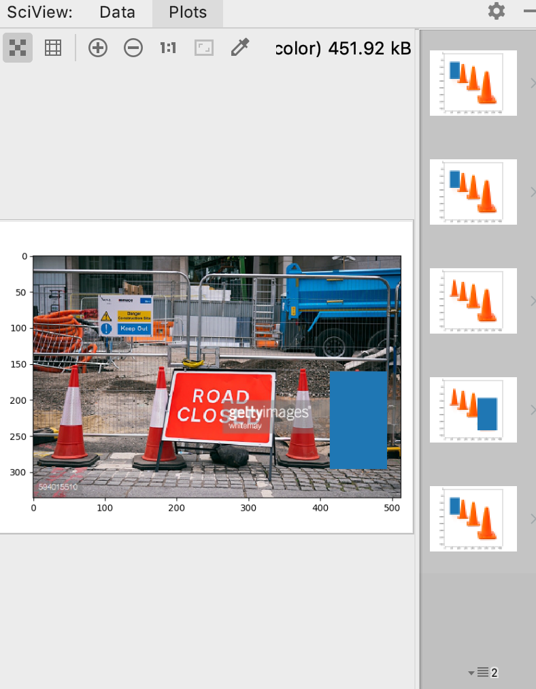
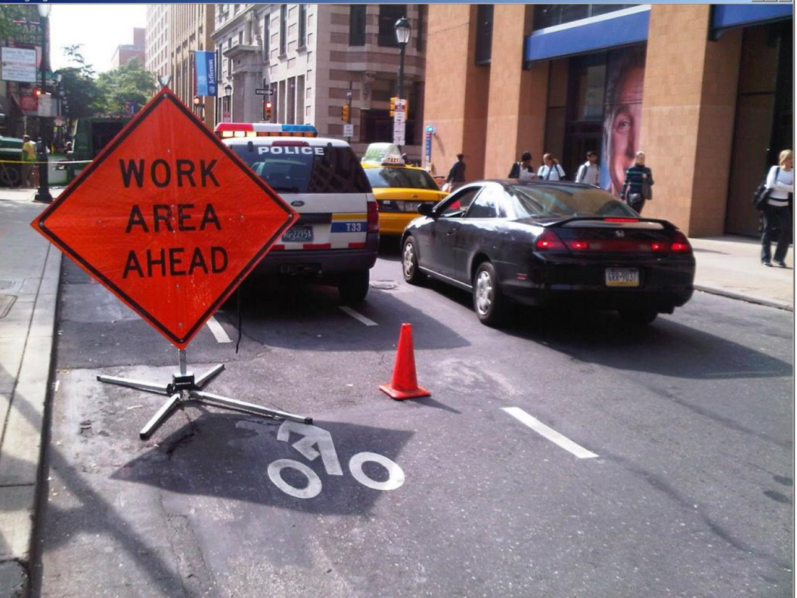
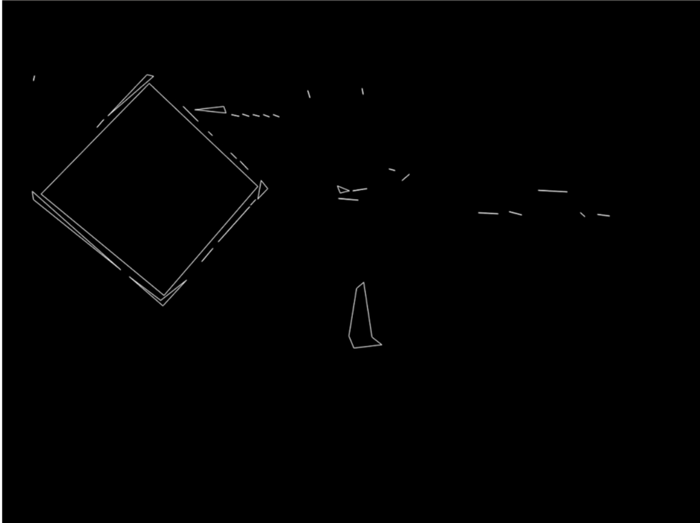
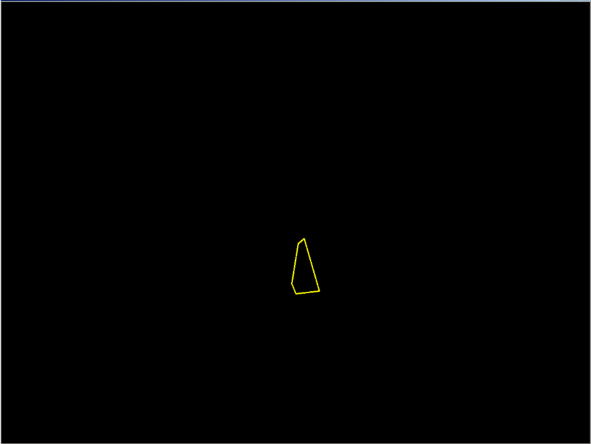
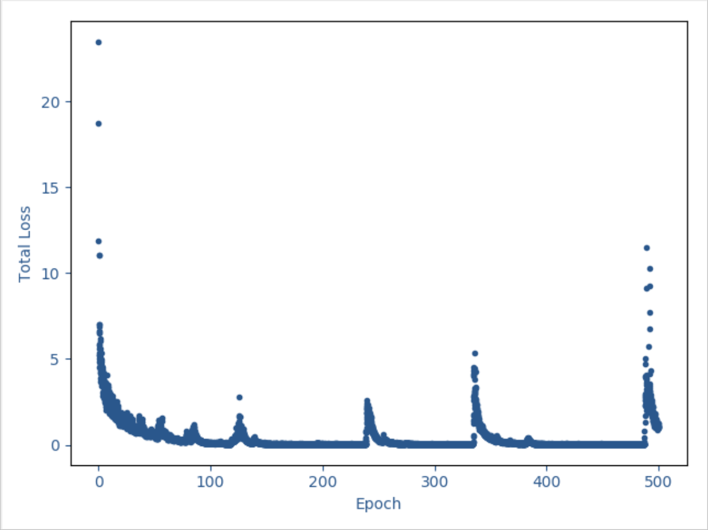
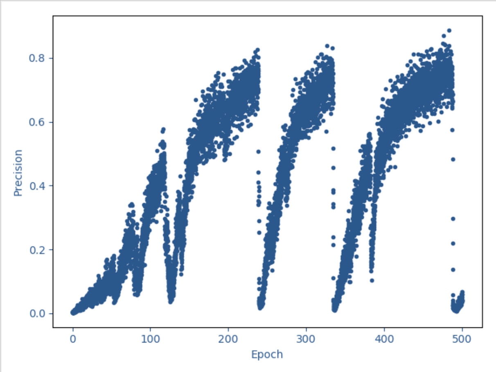
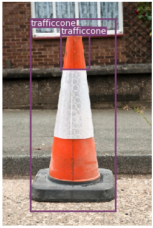
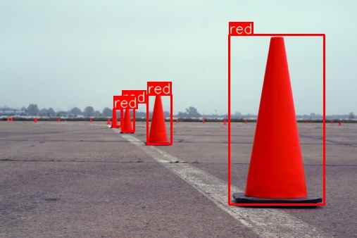
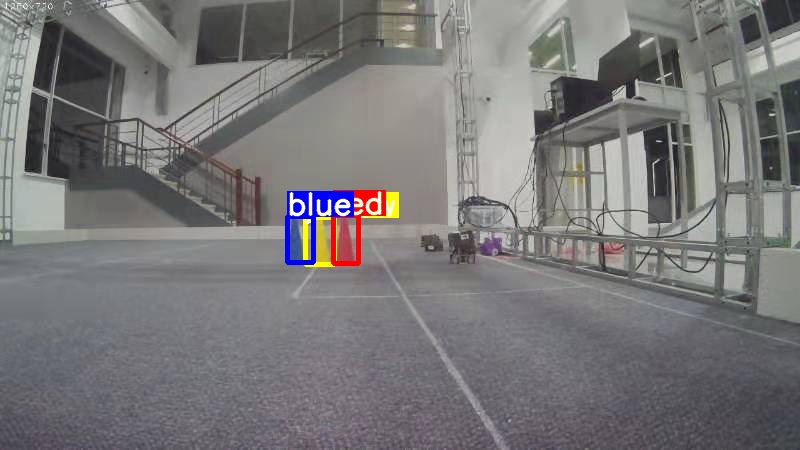

# Real-time Traffic Cones Detection For Automatic Racing

## 1.Dataset Preparation
First I refered datasets from [Apollo](apolloscape.auto), [BDD100K](https://medium.com/@karol_majek/bdd100k-dataset-25e83e09ebf8), [SUN](http://groups.csail.mit.edu/vision/SUN/scenes/pages/t/toll_plaza/index.html), but they failed to meet the demands in quantity for YOLO training.

Finally I downloaded [this dataset](https://www.dropbox.com/s/fag8b45ijv14noy/cone_dataset.tar.gz?dl=0), with about 260 photos of traffic cones, combined with photos taken by Xiaomi. Since annotation in this dataset is incomplete, I labeled them manually using the tool provided in [labelImg](https://github.com/tzutalin/labelImg).

Dataset now available at [here (updated)](https://drive.google.com/file/d/1YiIPC1m8EDJyj5R7FV5hyRAjHOe9_Bmd/view?usp=sharing), in PASCAL VOC format, and YOLOv3 format.

example of label

## 2.Training YOLOv3
At first I want to detect cones in simple graphic method, that is, using Hough Transform to find convex cones in the image, and then identifying them based on color, shape or so.

  

simple graphic method

However, considering the complex background on lane while real-time driving, this method appears to be inaccurate. Then I took SVM+HOG into account, which is also frequently-used in feature detection.

But SVM failed in speed. YOLO(You Only Look Once) network performs well both in spped and accuracy(reaching 70 fps), so finally I choose [YOLOv3](https://github.com/eriklindernoren/PyTorch-YOLOv3). (Before this choice I considered YOLOv2, but failed in compiling CUDA env.)

After 500 epochs of training, total loss has been reduced to a fairly low level (min=0.011), with precision up to 0.887. However in the detection valid task, nothing can be detected. I've opened an [issue](https://github.com/eriklindernoren/PyTorch-YOLOv3/issues/126). 

What's more, exploding gradient problem happened, as shown below:

After fixing 2 bugs mentioned in [issue127](https://github.com/eriklindernoren/PyTorch-YOLOv3/issues/127), now pretty good results.

## 3.Performance

As is shown above, after transforming to another impletation and modifying parameters, the exploding gradient problem has been solved. In this single-class network, total loss can be as low as 0.03, with **mAP reaching 98%, recall 98%, precision 99%**.

As for speed, testing single images(not video stream) **on 1080Ti is about 60 fps**. Haven't tested on tx2 yet. To accelerate, consider tiny-yolov3 or turn down the input size.

In addition, the model just detects traffic cone, regardless of its color. So for each cone detected, we extract the half bottom of the bounding box's perpendicular and calculate its average RGB value, and decide which color the cone is(red, green, blue, yellow, dontknow). It only works well for standing cones, inclination or white reflective tape may affect accuracy. And mapping from sampling RGB to color name also depends on color and shape of cones in actual games. Counter-example like:

## 4.Have a Try!
+ Test: 
	- Download weights file [best.pt](https://drive.google.com/file/d/1cTnrWIjWcGjLzz44P6cCUxqh8teCaoFr/view?usp=sharing) and put it in `weights/`. 
	- Put the images you want to detect in `data/samples/`.
	- Run `detect.py`.

+ Train: 
	- Edit your own dirs in `convert_yolov3.py` and run it.
	- Run `train.py`.

+ Improve color decision:
	- edit `utils/utils.py/plot_one_box()`.
