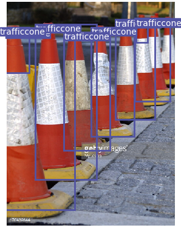
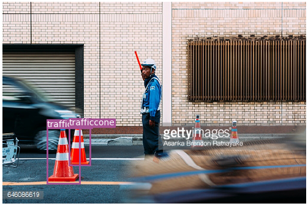

# Real-time Traffic Cones Detection For Automatic Racing

## 1.Dataset Preparation
First I refered datasets from [Apollo](apolloscape.auto), [BDD100K](https://medium.com/@karol_majek/bdd100k-dataset-25e83e09ebf8), [SUN](http://groups.csail.mit.edu/vision/SUN/scenes/pages/t/toll_plaza/index.html), but they failed to meet the demands in quantity for YOLO training.

Finally I downloaded [this dataset](https://www.dropbox.com/s/fag8b45ijv14noy/cone_dataset.tar.gz?dl=0), with about 260 photos of traffic cones, combined with photos taken by Xiaomi. Since annotation in this dataset is incomplete, I labeled them manually using the tool provided in [labelImg](https://github.com/tzutalin/labelImg).

Dataset now available at my [jbox](https://jbox.sjtu.edu.cn/l/UHk231), in PASCAL VOC format, and YOLOv3 format.

example of label

## 2.Training YOLOv3
At first I want to detect cones in simple graphic method, that is, using Hough Transform to find convex cones in the image, and then identifying them based on color, shape or so.

  

simple graphic method

However, considering the complex background on lane while real-time driving, this method appears to be inaccurate. Then I took SVM+HOG into account, which is also frequently-used in feature detection.

But SVM failed in speed. YOLO(You Only Look Once) network performs well both in spped and accuracy(reaching 70 fps), so finally I choose [YOLOv3](https://github.com/eriklindernoren/PyTorch-YOLOv3). (Before this choice I considered YOLOv2, but failed in compiling CUDA env.)

After 500 epochs of training, total loss has been reduced to a fairly low level (min=0.011), with precision up to 0.887. However in the detection valid task, nothing can be detected. I've opened an [issue](https://github.com/eriklindernoren/PyTorch-YOLOv3/issues/126). 

What's more, exploding gradient problem happened, as shown below:

After fixing 2 bugs mentioned in [issue127](https://github.com/eriklindernoren/PyTorch-YOLOv3/issues/127), now pretty good results as follows:

## 3.TODO next
+ Since the traffic cone used in our race is adhered with white reflective tape, top part of the cone may be mismatched, like shown below: 
So if a rectangle inside another one, eliminate the inner one.
+ Color decision. Now I consider sampling in the detected area.
+ Speed test.
+ Try some other networks, tiny-yolov3 or yolov3 implemented in PyTorch1.0, etc.

